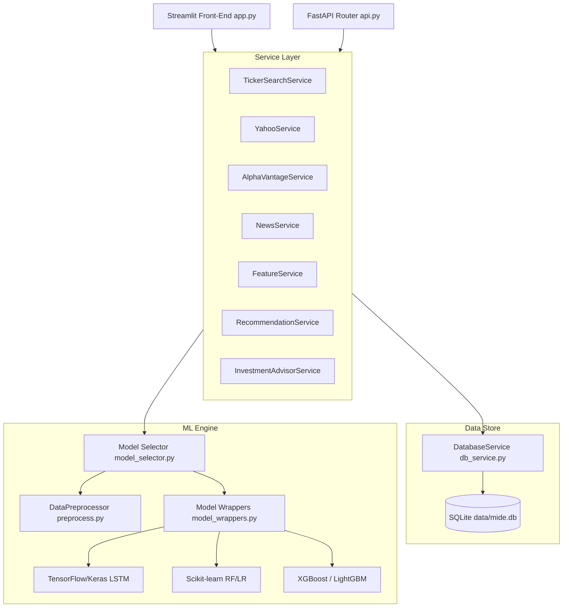
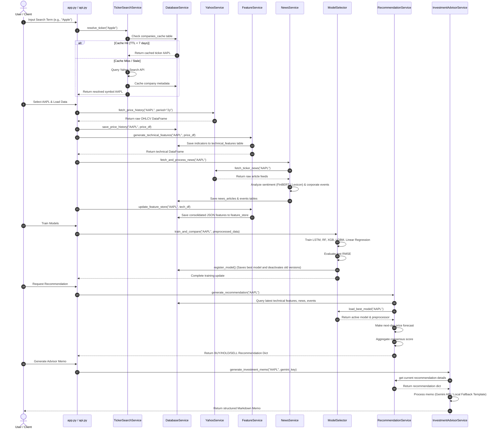
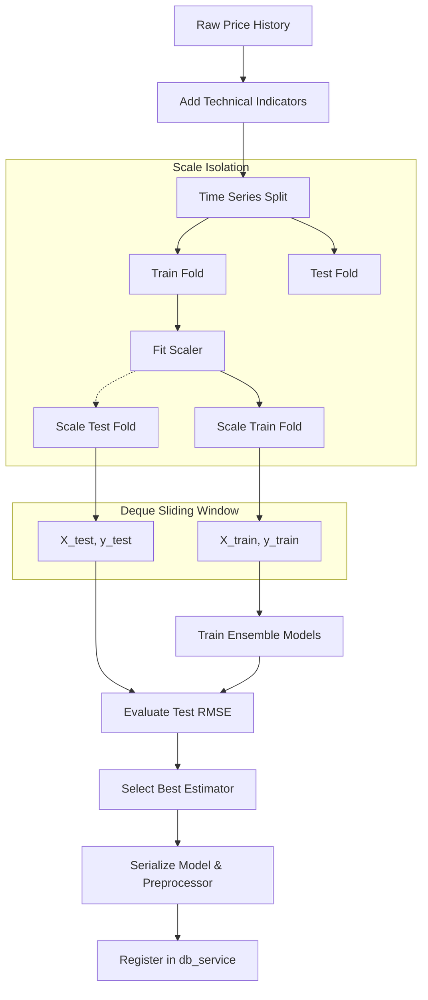

# ARGUS Intelligent Market Analytics Platform

ARGUS is a decision-support platform that integrates historical price data, technical analysis, news sentiment mining, and machine learning forecasts to assist in stock trading. Built as a decoupled multi-service system, the project serves a dual purpose: providing production-ready financial pipelines (using FastAPI, SQLAlchemy, and TensorFlow) alongside explicit implementations of custom data structures (sliding queues, pattern stacks, heaps) for academic demonstration.

The platform provides a graphical interface built in Streamlit for visualizing historical price feeds, training predictive regressors, simulating paper trading, backtesting rule-based strategies, and generating investment advisory memos.

---

## 1. Problem Statement
Active retail traders face a fragmentation of information when compiling an investment thesis:
* **Heterogeneous Data Feeds**: Price time-series data must be combined with technical calculations, corporate sentiment indicators, and high-impact catalyst events (e.g., job cuts or executive departures).
* **Data Leakage in Backtesting**: Basic temporal validation pipelines often introduce forward-looking bias during feature scaling or sequence generation, rendering backtest returns unrealistic.
* **Rate Limits and API Lockouts**: Automated systems frequently trigger provider rate limits (such as yfinance or Alpha Vantage thresholds) without dynamic queues or caching frameworks.
* **Opaque ML Forecasts**: Traditional model predictions output raw numbers without contextual risk estimation, sentiment integration, or explainable feature attribution.

ARGUS addresses these challenges by decoupling the data acquisition, persistence, and machine learning layers, ensuring that data is cached locally, sequences are constructed without leakage, and predictions are backed by multi-signal rules and explainability tools.

---

## 2. Key Features
* **Symbol Resolution & Caching**: Translates plain-text search terms into exchange-validated symbols using Yahoo Search APIs and stores resolved targets in a cache with a 7-day time-to-live (TTL).
* **Vectorized & Educational Indicators**: Calculates baseline indicators (SMA, EMA, RSI, MACD, Bollinger Bands, Stochastic, Support/Resistance) using fast Pandas vectorized operations for production, and custom deque/stack iterators for academic comparison.
* **Versioned Model Registry**: Cross-trains five distinct regression architectures (Linear Regression, Random Forest, XGBoost, LightGBM, and sequential/attention LSTMs), evaluates them on test datasets, and saves the best performer as the active version.
* **Sentiment & Event Extraction**: Scrapes financial articles, computes continuous sentiment polarity via Hugging Face's FinBERT, and classifies corporate milestones (e.g., regulatory fines, earnings surprises) using regular expressions.
* **Walk-Forward Backtesting**: Employs chronological cross-validation with fold-isolated scaling to evaluate regression performance and strategy returns without data leakage.
* **Paper Trading Client**: Simulates transaction logs and allocation updates against a virtual cash balance, fetching live closing prices to calculate portfolio value.
* **Generative Advisory Reports**: Integrates Google Gemini models to synthesize quantitative metrics, news catalysts, and model predictions into structured advisory memos.

---

## 3. Screenshots & Visualizations
The system automatically compiles performance metrics and saves diagnostic plots. A generated dashboard summary is located at [stock_analysis_results.png](file:///c:/Users/Shriyash%20Kothe/OneDrive/Desktop/2nd%20year/3rd%20sem/DS%20cp/Sem3%20DS%20cp/stock_analysis_results.png):

* **Price & Technicals**: Visualizes candlesticks with Bollinger Bands and moving average curves.
* **Model Validation**: Compares predictions against out-of-sample data points and plots residuals.
* **Data Structure Metrics**: Tracks memory and execution efficiencies for sliding windows, stacks, hashes, and heaps.

---

## 4. Architecture Overview

ARGUS is structured as a decoupled, multi-tier system:



The system is separated into three distinct layers:
1. **Presentation Layer**: 
   * `app.py`: Streamlit multi-page interface exposing dashboard metrics, charts, model training parameters, paper trading order forms, settings, and logs.
   * `api.py`: FastAPI REST routing exposing predictions, trade submissions, and recommendations for headless execution.
2. **Service Layer**:
   * Domain services coordinates data retrieval (`YahooService`, `AlphaVantageService`), input resolution (`TickerSearchService`), database logging (`DbLoggingHandler`), feature assembly (`FeatureService`), sentiment assessment (`NewsService`), portfolio logic (`RecommendationService`), and reporting (`InvestmentAdvisorService`).
3. **Engine Layer**:
   * `ds_helpers.py`: Implements custom data structures (FIFO, LIFO, Heap, Hash) used for sequence generation and asset ranking.
   * `preprocess.py`: Handles feature scaling, temporal splits, and sequence generation.
   * `model.py` & `model_wrappers.py`: Core TensorFlow models and adapter classes enforcing standard prediction and evaluation contracts.
   * `backtest.py`: Chronological walk-forward test validation runner.
   * `db_service.py`: SQLAlchemy ORM mapping SQLite columns to Python classes.

---

## 5. Execution Flow

The sequence diagram below traces the path from an initial stock search to a generated trade recommendation and advisory memo:



---

## 6. Folder Structure

```
.github/
└── workflows/
    └── ci.yml               # Automated flake8 linting and pytest runners
data/                        # Database migrations directory
└── mide.db                  # Local SQLite database file containing price, news, and log tables
models/                      # Trained weights and preprocessors registry
├── trained_lstm_model.h5    # Default trained LSTM network
└── feature_scaler.pkl       # Fitted MinMaxScaler binaries
stock_analyzr/
└── src/
    ├── models/
    │   ├── base_model.py    # ABC interface contract for ML estimators
    │   ├── explainability.py# Tree explainer utilizing SHAP or feature importance fallbacks
    │   ├── model_selector.py# Evaluates estimators and registers the best version
    │   └── model_wrappers.py# Model adapters wrapping Keras, Scikit-learn, and boosting frameworks
    ├── services/
    │   ├── advisor_service.py        # Markdown report generator (Gemini API vs local)
    │   ├── alpha_vantage_service.py  # Premium indicator API gateway with active rate limits
    │   ├── db_service.py             # SQLAlchemy models and SQLite connection controller
    │   ├── feature_service.py        # Vectorized indicator math and feature store assembly
    │   ├── log_service.py            # Logger routing stream, file, and database outputs
    │   ├── news_service.py           # Ingests articles, processes sentiments, and extracts events
    │   ├── recommendation_service.py # Rules-engine decision analyzer and backtest simulator
    │   ├── ticker_service.py         # Search query name resolution and ticker validations
    │   └── yahoo_service.py          # Downloads prices and news feeds via yfinance
    ├── api.py               # FastAPI REST endpoint routers
    ├── app.py               # Streamlit multi-page interface dashboard
    ├── backtest.py          # Walk-forward cross-validation executor
    ├── ds_helpers.py        # Explicit educational data structure implementations (FIFO, LIFO, Heap)
    ├── indicators.py        # Educational technical indicator calculations (iterative queue-based)
    ├── model.py             # Core TensorFlow LSTM architecture definitions
    └── preprocess.py        # Sequence creation, scaling transformations, and temporal splits
tests/
├── api_test_runner.py       # API server integration checks
├── db_verifier.py           # Relational schema checks
└── test_mide.py             # Automated unit checks (fixture-based)
Dockerfile                   # Debian-slim Docker image build instructions
docker-compose.yml           # Compose file coordinating FastAPI and Streamlit containers
requirements.txt             # Unified Python dependencies file
run_lstm_example.py          # Command-line demo script running the pipeline end-to-end
```

---

## 7. Technology Stack

* **Programming Language**: Python 3.9+
* **Data Processing & Analytics**: Pandas, NumPy
* **Machine & Deep Learning**: TensorFlow (Keras), Scikit-Learn, XGBoost, LightGBM, SHAP
* **Natural Language Processing**: Hugging Face Transformers (FinBERT)
* **Web Frameworks**: Streamlit (Dashboard), FastAPI (REST API), Uvicorn (ASGI server)
* **Database Layer**: SQLAlchemy (ORM), SQLite (Relational DB)
* **API Providers**: yfinance (Yahoo Finance), alpha_vantage (Premium indicators), NewsAPI (Alternative news), Google Generative AI (Gemini memos)
* **Testing & Quality Assurance**: pytest, flake8
* **Deployment & Containerization**: Docker, Docker Compose

---

## 8. Database Design

SQLite is used for data persistence. The relational schema is declared via SQLAlchemy ORM in `db_service.py`. The tables are designed as follows:

```mermaid
erDiagram
    COMPANIES {
        INTEGER id PK
        VARCHAR ticker UK "Index"
        VARCHAR name
        VARCHAR exchange
        VARCHAR country
        VARCHAR currency
        VARCHAR sector
        VARCHAR industry
    }
    COMPANIES_CACHE {
        VARCHAR ticker PK "Index"
        VARCHAR company_name
        VARCHAR exchange
        VARCHAR country
        VARCHAR currency
        VARCHAR sector
        VARCHAR industry
        DATETIME last_verified
    }
    PRICE_HISTORY {
        INTEGER id PK
        VARCHAR ticker FK "Index"
        DATE date "Index"
        FLOAT open
        FLOAT high
        FLOAT low
        FLOAT close
        FLOAT volume
    }
    TECHNICAL_FEATURES {
        INTEGER id PK
        VARCHAR ticker "Index"
        DATE date "Index"
        FLOAT daily_return
        FLOAT log_return
        FLOAT moving_avg_20
        FLOAT ema_20
        FLOAT rsi
        FLOAT macd
        FLOAT macd_signal
        FLOAT macd_hist
        FLOAT bollinger_upper
        FLOAT bollinger_lower
        FLOAT volatility
        FLOAT volume_change
    }
    NEWS_ARTICLES {
        INTEGER id PK
        VARCHAR ticker "Index"
        VARCHAR headline
        TEXT summary
        VARCHAR source
        VARCHAR url
        DATETIME published_date "Index"
        FLOAT sentiment_score
        FLOAT sentiment_confidence
    }
    EVENTS {
        INTEGER id PK
        VARCHAR ticker "Index"
        VARCHAR event_type "Index"
        VARCHAR sentiment
        FLOAT confidence
        FLOAT severity
        TEXT description
        DATETIME date "Index"
    }
    FEATURE_STORE {
        INTEGER id PK
        VARCHAR ticker "Index"
        DATE date "Index"
        TEXT features_json
    }
    SYSTEM_LOGS {
        INTEGER id PK
        DATETIME timestamp "Index"
        VARCHAR level
        VARCHAR module
        TEXT message
    }
    PORTFOLIO_STATE {
        INTEGER id PK
        FLOAT cash
        FLOAT initial_capital
        DATETIME updated_at
    }
    HOLDINGS {
        VARCHAR ticker PK "Index"
        FLOAT shares
        FLOAT avg_purchase_price
        DATETIME updated_at
    }
    TRANSACTIONS {
        INTEGER id PK
        VARCHAR ticker "Index"
        VARCHAR action
        FLOAT shares
        FLOAT price
        DATETIME timestamp
    }
    MODEL_REGISTRY {
        INTEGER id PK
        VARCHAR ticker "Index"
        VARCHAR model_type
        INTEGER version
        VARCHAR filepath
        TEXT metrics_json
        INTEGER is_active
        DATETIME created_at
    }

    COMPANIES ||--o{ PRICE_HISTORY : "has"
```



### Table Details:
1. **`companies`**: Holds metadata for tracked symbols. Has a one-to-many relationship with `price_history` using a cascade delete constraint on the ticker key.
2. **`companies_cache`**: Acts as a search discovery buffer to prevent calling external Search APIs repeatedly for the same string. Entries expire after 7 days.
3. **`price_history`**: Stores standard OHLCV prices indexed by ticker and date.
4. **`technical_features`**: Holds daily indicators generated from the raw price histories.
5. **`news_articles`**: Records headlines, summaries, sources, URLs, and continuous sentiments (ranging from -1.0 to 1.0) for fetched stories.
6. **`events`**: Tracks extracted corporate events, classified with severity levels (e.g., 0.95 for Fraud/CEO Arrests, 0.75 for layoffs).
7. **`feature_store`**: A consolidated data storage table containing serialized JSON records matching indicators and news sentiments for easy machine learning ingestion.
8. **`system_logs`**: Logging sink configured to record runtime messages directly to the database.
9. **`portfolio_state`**, **`holdings`**, **`transactions`**: Manage virtual balances, average share costs, and executed trades.
10. **`model_registry`**: Registers versions of models, tracking file paths, test metrics, and active toggles.

---

## 9. Machine Learning Pipeline



### Sequence Creation
LSTMs require input tensors of shape `(samples, sequence_length, features)`. Standard sliding window loops can be memory intensive on large arrays. ARGUS provides a `SlidingWindowQueue` wrapping `collections.deque` with a fixed capacity. As data points stream in, the queue maintains the window at O(1) complexity, outputting features and next-day close targets without nesting index loops.

### Scale Isolation (Data Leakage Prevention)
To ensure validation results match live trading conditions, ARGUS enforces strict temporal checks:
* **No Random Splits**: Splitting is done sequentially based on time (e.g., 70% Train, 15% Validation, 15% Test). Random cross-validation is blocked since shuffling leaks forward information.
* **Fitted Parameter Isolation**: Preprocessing parameters (such as MinMaxScaler minimums and maximums) are computed *only* on the training fold. The resulting boundaries are then applied to validate test folds. Scaling is fit and applied within each cross-validation window in `backtest.py` to prevent data leakage.
* **Inference Guard**: The `prepare_inference_data` method uses pre-fitted parameters stored in the model registry to process live data, verifying that the scaling bounds remain unmodified.

### Model Architectures
* **LSTM (RNN)**: Built in TensorFlow, the architecture supports standard sequences, deep stacks, bidirectional layers, and multi-head self-attention mechanisms with dropout regularizers and early stopping callbacks.
* **Ensemble Tree Models**: Random Forest, XGBoost, and LightGBM regressors are trained on flattened sequences (mapping sequence windows to 2D arrays).
* **Baseline**: Standard Linear Regression provides a baseline to verify deep learning performance.

### Model Registry
The registry handles model activation and versioning. Training an ensemble writes the estimators to `models/`, compares their out-of-sample RMSE, pickles the preprocessor structure, and flags the best performer as the active model in the database, deactivating older versions.

---

## 10. Recommendation Engine

The engine generates trading decisions by calculating a consensus score across multiple data streams:

| Category | Indicator Condition | Recommendation Impact | Score Value |
| :--- | :--- | :--- | :--- |
| **Technical** | RSI < 30 | Strong Bullish (Oversold) | `+1.5` |
| **Technical** | RSI > 70 | Strong Bearish (Overbought) | `-1.5` |
| **Technical** | RSI < 45 | Mild Bullish (Positive Momentum) | `+0.5` |
| **Technical** | RSI > 55 | Mild Bearish (Cooling Momentum) | `-0.5` |
| **Technical** | MACD > Signal | Bullish Crossover | `+1.0` |
| **Technical** | MACD < Signal | Bearish Crossover | `-1.0` |
| **Technical** | Price <= Bollinger Lower | Reversion Buy | `+1.0` |
| **Technical** | Price >= Bollinger Upper | Reversion Sell | `-1.0` |
| **Technical** | Price > 20-day EMA | Uptrend Support | `+1.0` |
| **Technical** | Price < 20-day EMA | Downtrend Resistance | `-1.0` |
| **Sentiment** | Avg News Polarity > 0.15 | Bullish News Bias | `+1.0` |
| **Sentiment** | Avg News Polarity < -0.15 | Bearish News Bias | `-1.0` |
| **Events** | Positive Event (e.g. Split) | Catalyst Bullish | `+ (severity * 1.5)` |
| **Events** | Negative Event (e.g. Fines) | Catalyst Bearish | `- (severity * 1.5)` |
| **Model** | Forecast Return > 1.5% | Predict Buy | `+1.5` |
| **Model** | Forecast Return < -1.5% | Predict Sell | `-1.5` |
| **Model** | Forecast Return > 0% | Predict Flat Up | `+0.5` |
| **Model** | Forecast Return < 0% | Predict Flat Down | `-0.5` |

### Signal Consensus:
* **BUY**: Consensus Score $\ge +2.0$
* **SELL**: Consensus Score $\le -2.0$
* **HOLD**: $-2.0 < \text{Consensus Score} < +2.0$
* **Confidence Rating**: Extrapolates the absolute score against the maximum possible bounds, mapping values to a range between $50\%$ and $95\%$.

---

## 11. News & Event Intelligence

### News Ingestion
Downloads article lists from Yahoo Finance and parses details like publisher, publication timestamp, headline, and summary. If a `NEWS_API_KEY` is configured in the environment, the engine also queries NewsAPI endpoints and merges articles while checking for duplicate headlines.

### Sentiment Analysis
* **FinBERT Pipeline**: If Hugging Face `transformers` is available, the engine loads `yiyanghkust/finbert-tone`. The pipeline returns labels (`Positive`, `Negative`, `Neutral`) and confidence scores, which are scaled to a continuous score between `-1.0` and `+1.0`.
* **Lexicon Fallback**: If transformers cannot be loaded due to CPU limits, the engine uses dictionary word-matching against pre-defined positive and negative lexicons, calculating sentiment scores based on word counts.

### Event Extraction
Scans headlines and summaries for corporate events using regex patterns. If a pattern matches, the engine records the event type, assigns a sentiment direction, and sets a severity score:

```python
EVENT_PATTERNS = {
    "CEO Appointment": [r"\bnew ceo\b", r"appoints? ceo", r"chief executive officer\b.*appoint"],
    "CEO Resignation": [r"ceo resigns?", r"ceo step.*down", r"resignation of ceo"],
    "CEO Death": [r"ceo dies\b", r"death of ceo", r"ceo passed away"],
    "CEO Arrest": [r"ceo arrested", r"arrest of ceo"],
    "Fraud": [r"fraud\b", r"scam\b", r"insider trading", r"embezzlement", r"sec charges"],
    "Acquisition": [r"acquires?\b", r"acquisition\b", r"bought out\b", r"takeover\b"],
    "Merger": [r"merger\b", r"merges?\b", r"amalgamation\b"],
    "Layoffs": [r"layoffs?\b", r"cuts? jobs?\b", r"downsizing\b", r"lay off\b"],
    "Dividend": [r"dividends?\b", r"payout\b", r"declare.*dividend"],
    "Stock Split": [r"stock split\b", r"share split\b"],
    "Patent": [r"patents?\b", r"grants? patent"],
    "Regulatory Action": [r"fined\b", r"regulatory action", r"investigated by sec", r"sanctioned?\b"],
    "Product Launch": [r"unveils?\b", r"launches?\b", r"introduces?\b", r"new product\b"],
    "Quarterly Earnings": [r"quarterly earnings", r"earnings report", r"reports q[1-4]", r"earnings beat", r"earnings miss"]
}
```

---

## 12. Paper Trading Simulation
The paper trading simulation runs in a sandbox environment:
* **Capital**: Starts with a default virtual cash balance of `$100,000.00` (which can be reset in the admin UI).
* **Holdings**: Maintains average purchase costs across assets. Buying more shares of an asset updates the cost basis dynamically:
  $$\text{New Average Price} = \frac{(\text{Current Shares} \times \text{Avg Cost}) + (\text{New Shares} \times \text{Execution Price})}{\text{Current Shares} + \text{New Shares}}$$
* **Order Execution**: Simulates BUY and SELL trades, checks for cash limits, and logs transactions in the `transactions` table.
* **Valuation**: Queries yfinance for the latest closing prices to calculate current holdings value and portfolio P&L.

---

## 13. FastAPI Endpoints

FastAPI exposes REST endpoints for headless execution (port 8000):

* **`GET /health`**
  Returns database diagnostics, connectivity status, and registered active model configurations.
* **`GET /predict?ticker={symbol}`**
  Fetches the active model version and scales input sequences to predict the next-day price.
* **`GET /news?ticker={symbol}`**
  Returns scraped articles and calculated sentiment metrics.
* **`GET /events?ticker={symbol}`**
  Returns classified events and severity scores.
* **`GET /recommend?ticker={symbol}`**
  Aggregates indicators and forecasts to return a consensus action (BUY/HOLD/SELL).
* **`GET /recommend/backtest?ticker={symbol}&lookback_days={days}`**
  Simulates historical recommendations and returns cumulative returns, Sharpe ratio, and transaction logs.
* **`GET /portfolio`**
  Returns account metrics, including holdings, valuations, P&L, and asset allocations.
* **`POST /trade`**
  Executes a paper trade transaction. Expects JSON body:
  ```json
  {
    "ticker": "AAPL",
    "action": "BUY",
    "shares": 10.0,
    "price": 180.50
  }
  ```
* **`GET /advisor?ticker={symbol}&gemini_key={optional_key}`**
  Compiles an investment advisor memo.

---

## 14. Installation & Setup

### Prerequisites
* Python 3.9 installed locally.
* Build tools (`build-essential`) and C runtime compilers (for LightGBM/XGBoost compatibility).

### Installation Steps

1. **Clone the repository**:
   ```bash
   git clone https://github.com/Shriyash187/market-intelligence-decision-engine.git
   cd market-intelligence-decision-engine
   ```

2. **Initialize virtual environment**:
   ```bash
   python -m venv venv
   # On Windows:
   vscripts\activate
   # On macOS/Linux:
   source venv/bin/activate
   ```

3. **Install dependencies**:
   ```bash
   pip install --upgrade pip
   pip install -r requirements.txt
   ```

4. **Verify database tables**:
   ```bash
   python tests/db_verifier.py
   ```

---

## 15. Running the Project

### Standalone Command-Line Demo
Run the end-to-end demo script to test data structures, price fetching, LSTM training, backtesting, and visualization:
```bash
python run_lstm_example.py
```
Outputs are saved to `models/`, `data/`, and `stock_analysis_results.png`.

### Running the API Server (FastAPI)
Launch FastAPI on port 8000 using Uvicorn:
```bash
uvicorn stock_analyzr.src.api:app --host 127.0.0.1 --port 8000 --reload
```
View Swagger API documentation at: `http://127.0.0.1:8000/docs`

### Running the Interactive Web App (Streamlit)
Launch the dashboard on port 8501:
```bash
streamlit run stock_analyzr/src/app.py
```
Open `http://localhost:8501` in your browser.

---

## 16. Environment Variables
To configure API keys, set the following environment variables:

```bash
# Windows (Command Prompt)
set ALPHA_VANTAGE_API_KEY="your_api_key"
set NEWS_API_KEY="your_api_key"
set GEMINI_API_KEY="your_api_key"

# Windows (PowerShell)
$env:ALPHA_VANTAGE_API_KEY="your_api_key"
$env:NEWS_API_KEY="your_api_key"
$env:GEMINI_API_KEY="your_api_key"

# macOS / Linux
export ALPHA_VANTAGE_API_KEY="your_api_key"
export NEWS_API_KEY="your_api_key"
export GEMINI_API_KEY="your_api_key"
```

*Note: If no keys are set, ARGUS runs on Yahoo Finance prices, falls back to lexicon-based sentiment analysis, and uses local templates for advisor memos.*

---

## 17. Docker Deployment

The application is containerized to deploy both the API and Streamlit app.

### Run with Docker Compose
To build images and spin up containers:
```bash
docker-compose up --build
```

* **FastAPI Backend**: Exposed at `http://localhost:8000`
* **Streamlit Interface**: Exposed at `http://localhost:8501`

Data and trained models are persisted locally via Docker volumes mapped to `./data` and `./models`.

---

## 18. Testing

The codebase includes automated unit and integration tests.

### Run Unit Tests
Run the test suite using pytest:
```bash
pytest tests/
```
The suite verifies:
* Database operations.
* Model wrappers and registry versioning.
* Lexicon sentiment analysis fallbacks.
* Data preprocessor sequence creation.
* Leak-free feature scaling for inference.

### Run Integration Tests
Verify FastAPI HTTP endpoints:
```bash
python tests/api_test_runner.py
```
This launches Uvicorn, queries REST paths, tests transaction requests, and terminates the server.

---

## 19. Known Limitations

* **Single-Threaded SQLite**: SQLite limits concurrent database writes. Under heavy API request volume, the database may lock temporarily.
* **API Rate Limits**: The Yahoo Finance API and NewsAPI have strict rate limits on free tiers. The system includes rate-limit guards, but heavy usage may still cause temporary blocks.
* **CPU Training Times**: Training deep LSTM models on a CPU can be slow. It is recommended to reduce training epochs when running the pipeline on a CPU.
* **Lexicon Sentiment Limitations**: The lexicon-based sentiment analyzer uses simple word matching, which does not capture negation or complex phrasing as accurately as the FinBERT transformer model.

---

## 20. Future Improvements

* **Vector Database Integration**: Store unstructured news articles in a vector database to search news by semantic relevance.
* **Parallel Data Fetching**: Implement asynchronous data fetching to speed up ingestion for large numbers of watched stocks.
* **Advanced Backtesting**: Add trading fees, transaction slippage, and short-selling capabilities to the strategy backtester.
* **Multi-Asset Support**: Expand the pipeline to support cryptocurrency and forex datasets.

---

## 21. License
Provided under the MIT License. For details, see the LICENSE file in the repository.

---

## 22. Contributors
Developed by Shriyash Kothe and contributors. Feel free to open issues or pull requests.
